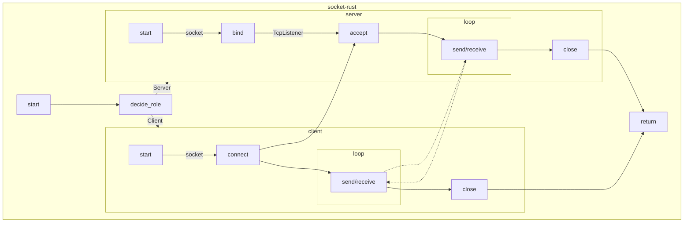

# socket communication with Rust

## usage

引数で s もしくは server を指定するとサーバー起動

```cmd
> cargo run s
```

引数で c もしくは client を指定するとクライアント起動

```cmd
> cargo run c
```


```mermaid
flowchart TD;
    subgraph socket-rust
    start ---> decide_role;
    decide_role -- Client ---> client;
    decide_role -- Server ---> server;

    subgraph server
    server_start[start] -->|socket| bind;
    bind -->|TcpListener| accept;
    accept --> server_msg[send/receive];
    subgraph server_loop[loop]
    server_msg
    end
    server_msg --> server_close[close]
    end

    subgraph client
    client_start[start] -->|socket| connect;
    connect --> client_msg[send/receive];
    subgraph client_loop[loop]
    client_msg
    end
    client_msg --> client_close[close]
    end


    connect --> accept
    server_msg -.-> client_msg
    client_msg -.-> server_msg

    server_close --> return
    client_close --> return;

    end


```
